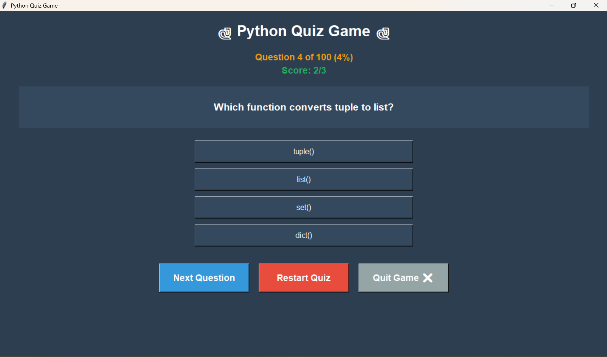

# 🐍 Python Quiz Application

An interactive desktop quiz application developed using Python and Tkinter.

## 📌 Overview

This project is a GUI-based Python quiz application that allows users
to answer multiple-choice questions and track their score.

Questions are randomly shuffled each time the quiz starts or restarts.

## 🖥️ Application Preview



## ✨ Features

- 🐍 Python-based quiz application
- 🖥️ Graphical User Interface using Tkinter
- ❓ Multiple-choice questions
- 🔀 Randomized question order
- 📊 Real-time score tracking
- 📈 Progress percentage
- ✅ Answer validation
- 💬 Correct-answer feedback
- 🔄 Restart Quiz option
- ❌ Quit Game option
- ⌨️ ESC key support

## 🛠️ Technologies Used

- Python
- Tkinter
- Random module

## 📂 Project Structure

```text
quiz-application/
│
├── quiz.py
├── mcqs.py
└── README.md

▶️ How to Run
1. Install Python

Make sure Python is installed on your computer.

2. Download or clone the repository
git clone https://github.com/prapti-patil/quiz-application.git
3. Open the project folder
cd quiz-application
4. Run the application
python quiz.py

The quiz window will open on your desktop.

🎮 How to Use
Start the application.
Read the displayed question.
Select one of the four options.
Click Next Question.
Continue until all questions are completed.
View your final score and percentage.
Use Restart Quiz to start again.
🧠 Quiz Logic

The application loads questions from mcqs.py and randomly shuffles
them before starting the quiz.

The application keeps track of:

Current question number
Selected answer
Correct answers
Total score
Completion percentage
🔮 Future Improvements
Add different quiz categories
Add difficulty levels
Add a timer for each question
Store high scores
Add a leaderboard
Add more question sets
Improve the graphical interface
👩‍💻 Author

Prapti Patil

Computer Engineering Student | Aspiring Software Developer

GitHub: https://github.com/prapti-patil

LinkedIn: https://www.linkedin.com/in/praptipatil30
